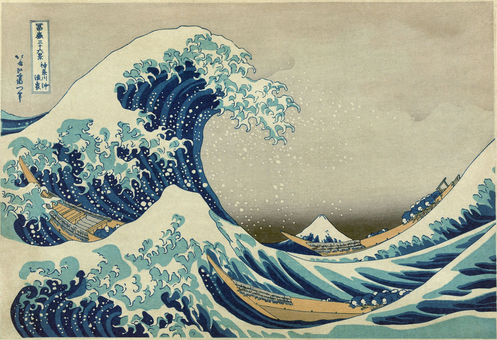

  

  <a href="https://en.wikipedia.org/wiki/The_Great_Wave_off_Kanagawa">🖼 The Great Wave off Kanagawa</a>

# Public Speaking
> A repository of my talk proposals, in progress, accepted or rejected

In the spirit of transparency and open source. I'm keeping all my talk plans and proposals public here in this repository. **I've never given a talk at a conference before** so this is all very new to me.

✨ Inspired by my friend and coworker [Joe Birch's PublicSpeaking repository](https://github.com/hitherejoe/PublicSpeaking).

### What's up with the ancient Japanese art?

I just really love that piece. 
